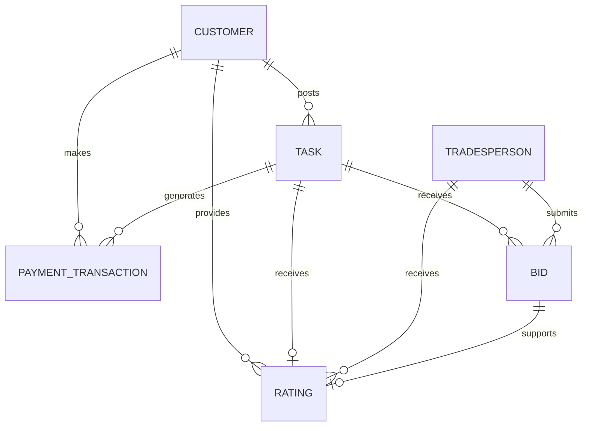

# Service Marketplace SQL Analytics

**Tools:** Oracle SQL • Relational Database Design • Data Validation • Business Analysis

## Project Overview

This project demonstrates the design and analysis of a fictional service marketplace database. The platform connects customers who post tasks with tradespeople who submit bids and complete the work.

The database was designed to help an operations team examine customer activity, tradesperson engagement, payment preferences and task-posting patterns.

This is an individual project. All names, contact details and transactions are synthetic and do not represent real users or commercial activity.

## Business Questions

The SQL analysis addresses five operational questions:

1. Which customers have not posted a task within the previous 30 days?
2. Which tradespeople have not submitted a bid within the previous 30 days?
3. How many days pass between a task being posted and its payment?
4. Which payment methods are used most frequently?
5. How does task-posting activity vary by month?

## Database Design

The relational model contains six connected entities:

* **Customer:** People who post tasks
* **Task:** Service requests created by customers
* **Tradesperson:** Service providers who bid on tasks
* **Bid:** Offers submitted by tradespeople
* **Payment Transaction:** Payments associated with tasks
* **Rating:** Customer feedback for completed work

  

Primary keys identify each record, while foreign keys preserve the relationships between customers, tasks, bids, payments and ratings. Additional validation constraints prevent negative amounts, unsupported status values, invalid ratings and inconsistent customer-task combinations.

## Repository Structure

| File                                                             | Purpose                                                         |
| ---------------------------------------------------------------- | --------------------------------------------------------------- |
| [`sql/01_create_schema.sql`](sql/01_create_schema.sql)           | Creates the six database tables and their integrity constraints |
| [`sql/02_insert_sample_data.sql`](sql/02_insert_sample_data.sql) | Loads a small, internally consistent fictional dataset          |
| [`sql/03_business_queries.sql`](sql/03_business_queries.sql)     | Contains the five operational analysis queries                  |

## Demonstrated Results

Using a fixed analysis date of 20 October 2024 produced the following reproducible outputs:

| Analysis                    | Sample result                                                           |
| --------------------------- | ----------------------------------------------------------------------- |
| Inactive customers          | 5 of 8 customers had no task within the previous 30 days                |
| Inactive tradespeople       | 5 of 8 tradespeople had no bid within the previous 30 days              |
| Posting-to-payment interval | The seven observed intervals ranged from 2 to 5 days                    |
| Payment preferences         | e-Wallet represented 4 of 7 payments; credit card represented 3 of 7    |
| Monthly task volume         | September contained 3 tasks, January 2, and February and October 1 each |

These results demonstrate how the queries work on the synthetic records. They should not be interpreted as evidence about a real marketplace or broader customer behaviour.

## SQL Techniques Demonstrated

* Relational table creation
* Primary, foreign and composite-key constraints
* `CHECK`, `UNIQUE` and `NOT NULL` validation
* Inner and outer joins
* Common table expressions
* Aggregate functions
* `GROUP BY` and `HAVING`
* Oracle date arithmetic
* Window functions
* Reproducible reporting dates
* Business-oriented query design

## Corrections and Validation

The original project was completed in October 2024. I later reviewed and improved the public portfolio version by:

* Correcting inconsistent customer, task and transaction references
* Removing a duplicated rating
* Correcting bid and payment date sequences
* Changing the original negative duration calculation to measure days from task posting to payment
* Using a fixed reporting date instead of `SYSDATE` so results remain reproducible
* Adding database constraints to prevent invalid or contradictory records
* Testing the schema, sample data and all five queries in Oracle Live SQL

The transaction date is used only as a proxy for the end of the service process. The database does not contain a separate task-completion timestamp, so the interval is not presented as a verified completion time.

## How to Run

1. Open an Oracle SQL environment such as Oracle Live SQL.
2. Run `sql/01_create_schema.sql`.
3. Run `sql/02_insert_sample_data.sql`.
4. Run `sql/03_business_queries.sql`.
5. Review the five result sets generated by the analysis script.

## Limitations

* The dataset contains only a small number of deliberately constructed records.
* The outputs demonstrate SQL functionality rather than statistically reliable business trends.
* Payment date may not equal the actual date a task was completed.
* The 30-day inactivity threshold is an illustrative business rule, not a validated churn definition.
* The `SKILLS` field is stored as text for this compact demonstration. A production database would normally separate skills into their own table and use a linking table for tradesperson-skill relationships.

## Author

**Tejashree Pillai**
[LinkedIn](https://www.linkedin.com/in/tejashreepillai/)
